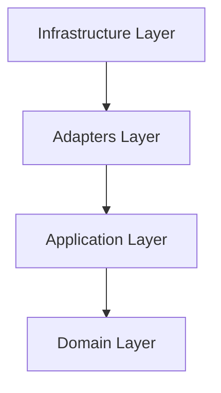

# Money Tracker Backend

This project is the backend for the Money Tracker application, built with **Python** and **FastAPI**.
It follows **Clean Architecture** (also known as Hexagonal Architecture or Ports and Adapters) to ensure scalability, maintainability, and separation of concerns.

## 🏗️ Architecture Overview

The codebase is organized into layers, where dependencies point **inwards**. The inner layers (Domain) rely on nothing, while outer layers (Infrastructure/Adapters) rely on inner layers.



### 📂 Folder Structure

```
.
├── docker-compose.yml             # Docker Compose (Database, Redis, etc.)
├── Dockerfile                     # Docker Image Configuration
├── pyproject.toml                 # Project Metadata
├── requirements.txt               # Dependencies
├── test/                          # Unit & Integration Tests
│   ├── test_adapters/
│   ├── test_application/
│   └── test_domain/
│
└── src/
    └── money_tracker/             # Source Code Utama
        ├── __init__.py
        ├── main.py                # Entry Point
        │
        ├── adapters/              # Interface & Drivers
        │   ├── api/               # External Interfaces
        │   │   ├── dependencies.py
        │   │   ├── limiter.py     # Rate Limiter Config
        │   │   ├── schemas.py
        │   │   ├── auth/          # Legacy/Extra Auth
        │   │   ├── graphql/       # GraphQL Resolvers
        │   │   └── rest/          # REST API Controllers
        │   │       └── auth.py
        │   ├── cache/             # Cache Adapters
        │   └── db/                # Database Implementation
        │       ├── models.py
        │       └── repositories/
        │           └── user_repo.py
        │
        ├── application/           # Business Logic
        │   ├── dtos/              # Data Transfer Objects
        │   │   └── auth_dto.py
        │   ├── ports/             # Contracts/Interfaces
        │   │   └── repositories/
        │   │       └── user_repo.py
        │   └── use_cases/         # Application Features
        │       └── register_user.py
        │
        ├── core/                  # Configuration
        │   ├── config.py
        │   └── dependencies.py
        │
        ├── domain/                # Enterprise Rules
        │   ├── exceptions.py
        │   └── models/
        │       └── user.py
        │
        └── infrastructure/        # Frameworks & Drivers
            ├── limiter.py         # Infrastructure Limiter
            ├── logging.py         # Logging Config
            ├── postgres.py        # Database Connection
            ├── qdrant.py          # Vector DB Connection
            └── redis.py           # Redis Connection
```

### Detailed Layer Description

#### 1. `domain/` (The Core)
*   **Role**: Contains the Enterprise Business Rules. Pure Python code. No dependencies on frameworks or libraries.
*   **Contents**:
    *   `models/`: Business Entities (e.g., `User`, `Transaction`).
*   **Example**: `User` entity with logic like `update_profile()`.

#### 2. `application/` (The Business Logic)
*   **Role**: Orchestrates the flow of data. Implements Use Cases.
*   **Contents**:
    *   `use_cases/`: Specific business actions (e.g., `RegisterUserUseCase`).
    *   `ports/`: Interfaces (contracts) that Adapters must implement (e.g., `UserRepository` interface).
    *   `dtos/`: Data Transfer Objects (Pydantic Models) for input/output.

#### 3. `adapters/` (The Interface Layers)
*   **Role**: Converts data from the outside world format to the inside world format and vice versa.
*   **Contents**:
    *   `api/`: External interfaces like REST API or GraphQL.
        *   `rest/`: FastAPI Routers (Controllers).
        *   `dependencies.py`: Dependency Injection wiring.
        *   `limiter.py`: Rate Limiting configuration.
    *   `db/`: Database logic.
        *   `models.py`: SQLAlchemy ORM Models (Database Tables).
        *   `repositories/`: Concrete implementation of Repository interfaces (e.g., `PostgresUserRepository`).

#### 4. `infrastructure/` (The Frameworks & Drivers)
*   **Role**: Tools and drivers the application uses.
*   **Contents**:
    *   `postgres.py`: Database connection setup (Async SQLAlchemy).
    *   `redis.py`: Cache connection.
    *   `qdrant.py`: Vector Database connection.

#### 5. `core/` (Configuration)
*   **Role**: General application settings.
*   **Contents**:
    *   `config.py`: Environment variables via `pydantic-settings`.

---

## 🛠️ Key Technologies

*   **FastAPI**: Modern, fast web framework for building APIs.
*   **SQLAlchemy (Async)**: ORM for PostgreSQL interactions.
*   **Pydantic**: Data validation and settings management.
*   **SlowAPI**: Rate limiting for API security.
*   **Passlib (Bcrypt)**: Secure password hashing.
*   **PostgreSQL**: Primary relational database.
*   **Redis**: In-memory data store (Caching).
*   **Qdrant**: Vector database for AI features.

## 🚀 Getting Started

### Prerequisites
*   Python 3.9+
*   PostgreSQL
*   Virtual Environment

### Installation

1.  **Clone Request**:
    ```bash
    git clone <repo_url>
    cd money_tracker_backend
    ```

2.  **Setup Virtual Environment**:
    ```bash
    python -m venv venv
    source venv/bin/activate  # On Windows: venv\Scripts\activate
    ```

3.  **Install Dependencies**:
    ```bash
    pip install -r requirements.txt
    ```

4.  **Configure Environment**:
    Create a `.env` file in the root directory (see `.env.example` if available).

5.  **Run Application**:
    ```bash
    uvicorn money_tracker.main:app --reload
    ```
    Access Swagger UI at `http://127.0.0.1:8000/docs`.

## 🛡️ Security Features
*   **Rate Limiting**: Protects API from spam (Default: 100 req/min).
*   **CORS**: Configured to allow Frontend access.
*   **Password Hashing**: Bcrypt for secure user credentials.

---
*Created by Antigravity (Google DeepMind) & User*
